# Themes

This is a repository for themes designed specifically for Aeriform [Tape](https://aeriform.itch.io/Tape).

These are based on the Hundred Rabbits Themes [Ecosystem](https://github.com/hundredrabbits), and compatible with those applications and tools. These themes are hosted here separately as they include additional definitions specific to Tape, out of the scope of the original Ecosystem.

Theme files are defined as SVG and easily modifiable.

To install a theme, simply drag and drop the theme file into Tape.

Available themes:

  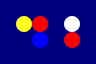 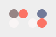 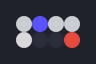 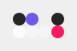 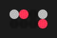 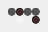  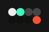   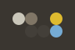 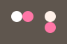 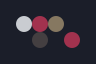 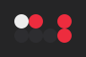  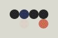 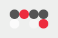 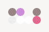   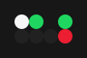 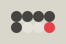 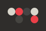  

Thanks to those that gave permission or blessing to create and distribute themes.

Contributions are welcome.