# Themes

This is a repository for themes designed specifically for Aeriform [Tape](https://aeriform.itch.io/Tape).

These are based on the Hundred Rabbits [Themes Ecosystem](https://github.com/hundredrabbits/Themes), and compatible with those applications and tools. These themes are hosted here separately as they include additional definitions specific to Tape, out of the scope of the original Ecosystem.

Theme files are defined as SVG and easily modifiable in a text editor.

To install a theme, simply drag and drop the theme file into Tape.

Available themes:

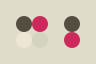  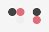  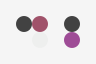 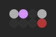  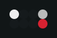   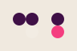      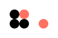  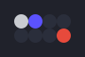 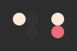  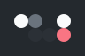 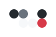 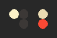   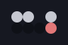     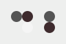   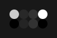  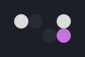  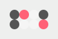 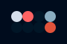      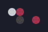  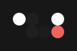 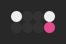   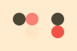       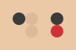 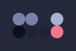  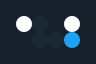   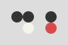 

The templates folder includes a guide for creating new themes, and utility theme for use with pywal.

Thanks to those that gave permission or blessing to create and distribute themes, and those that have contributed.