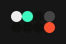
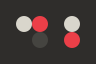

# Themes

This is a repository for themes designed specifically for Aeriform Tape. These are based on the Hundred Rabbits Themes [Ecosystem](https://github.com/hundredrabbits), and compatible with those applications and tools.

Theme files are defined as SVG and easily modifiable.

To install a theme, simply drag and drop the theme file into Tape.

Available themes:

            

Thanks to those that gave permission or blessing to create and distribute themes.

Contributions are welcome.
